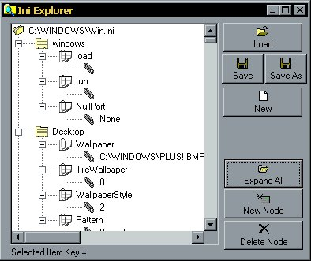

## INI Explorer

### Description

This is a fully working INI file reader. It reads an ini file in binary mode and extracts the text into a string. then it checks for certain characters to parse the file with. Finally it compiles the data and creates a tree of the data.

the tree is saveable and can be modified (Delete, New, Edit)
 
### More Info
 

             |
---                |---
**Submitted On**   |2000-03-20 21:41:12
**By**             |[Michael Pote](https://github.com/Planet-Source-Code/PSCIndex/blob/master/ByAuthor/michael-pote.md)
**Level**          |Intermediate
**User Rating**    |5.0 (15 globes from 3 users)
**Compatibility**  |VB 5\.0, VB 6\.0
**Category**       |[Complete Applications](https://github.com/Planet-Source-Code/PSCIndex/blob/master/ByCategory/complete-applications__1-27.md)
**World**          |[Visual Basic](https://github.com/Planet-Source-Code/PSCIndex/blob/master/ByWorld/visual-basic.md)
**Archive File**   |[CODE\_UPLOAD40953202000\.zip](https://github.com/Planet-Source-Code/michael-pote-ini-explorer__1-6712/archive/master.zip)

